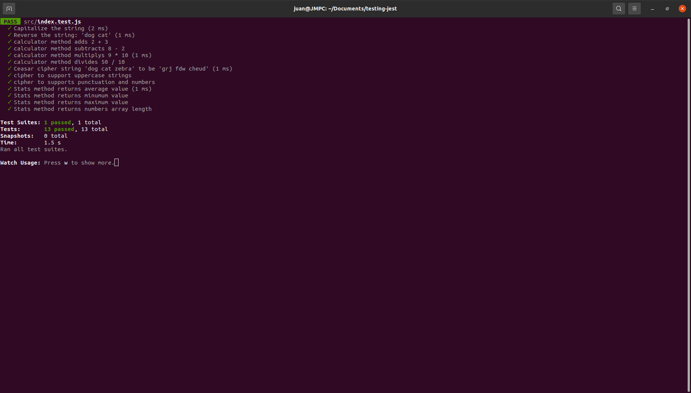

The purpose of this project was to practice simple testing with jest.

Run the project locally (prerequisites: yarn):

1. Download or clone the repository.
2. Open the terminal inside the root of the project and run:
3. yarn install
4. yarn run watch
5. press "a" to run all tests
